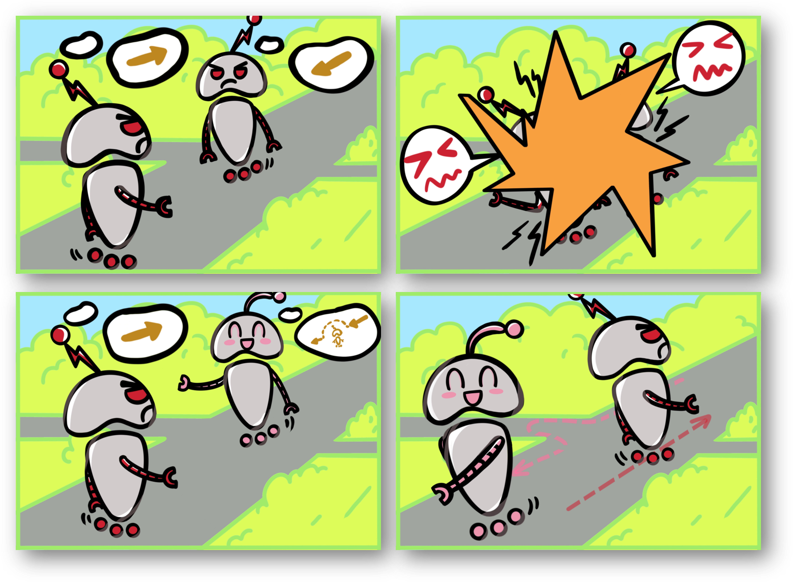

# Social Behavior as a Key to Learning-based Multi-Agent Pathfinding Dilemmas
This repository is the official implementation of [Social Behavior as a Key to Learning-based Multi-Agent Pathfinding Dilemmas](https://arxiv.org/abs/2408.03063).
The paper is currently under review.



## Environment Configuration
We provide the MAPF environment configuration we use (based on anaconda) and package it as a `MAPF.yml` file. You can load it with the following command:
```
conda env create -f MAPF.yml
```

## Start Training
Once we have confirmed that the environment has been configured, we can activate it with the following command:
```
conda activate MAPF
```
Then, we can run the main program to start training:
```
python driver.py
```
During the training process, the models and animated images will be stored in `/models` and `/gifs` respectively at fixed intervals.

## Tracking training
We provide an interface to track training using `wandb`, you can do this by setting `WANDB` to `True` in `alg_parameters.py`. In addition, you need to modify the following three parameters to the content of your own account correspondingly:
```
ENTITY = 'full_blank_1'
EXPERIMENT_PROJECT = 'full_blank_2'
EXPERIMENT_NAME = 'full_blank_3'
```

## Reference
If this repository is helpful to you, please cite our work by:
```
@article{he2024social,
  title={Social Behavior as a Key to Learning-based Multi-Agent Pathfinding Dilemmas},
  author={He, Chengyang and Duhan, Tanishq and Tulsyan, Parth and Kim, Patrick and Sartoretti, Guillaume},
  journal={arXiv preprint arXiv:2408.03063},
  year={2024}
}
```
```
@inproceedings{he2024alpha,
  title={Alpha: Attention-based long-horizon pathfinding in highly-structured areas},
  author={He, Chengyang and Yang, Tianze and Duhan, Tanishq and Wang, Yutong and Sartoretti, Guillaume},
  booktitle={2024 IEEE International Conference on Robotics and Automation (ICRA)},
  pages={14576--14582},
  year={2024},
  organization={IEEE}
}
```