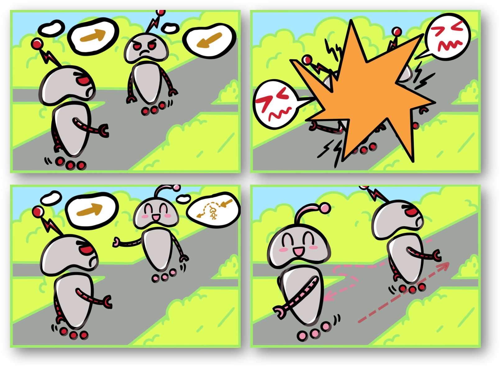

<div align="center">

<h1>SYLPH</h1>

<p><strong>Social Behavior as a Key to Learning-based Multi-Agent Pathfinding Dilemmas</strong></p>

<p>Official PyTorch implementation and pretrained evaluation package for multi-agent path finding (MAPF).</p>

<p>
  
  
  <a href="LICENSE.md"></a>
</p>

<p>
  <a href="#overview">Overview</a> ·
  <a href="#quick-start">Quick start</a> ·
  <a href="#pretrained-evaluation">Evaluation</a> ·
  <a href="#training">Training</a> ·
  <a href="#repository-layout">Repository layout</a>
</p>

</div>



## Overview

SYLPH is a learning-based MAPF framework designed to reduce the homogeneous behavior caused by sharing one decentralized policy among all agents. Each agent dynamically selects a Social Value Orientation (SVO)—representing behaviors ranging from selfish to altruistic—and conditions its movement policy on that choice.

| Component | Purpose |
| --- | --- |
| **Dynamic social behavior** | Lets agents choose situation-dependent SVOs to help resolve symmetric conflicts, bottlenecks, and deadlocks. |
| **Influential-agent selection** | Predicts future interactions and identifies the other agent most relevant to the current decision. |
| **SVO-conditioned policy** | Conditions movement decisions on each agent's selected social preference. |
| **Decentralized execution** | Retains the scalability of parameter sharing while allowing agents to adopt varied behaviors. |

For the method and experimental results, see the paper [Social Behavior as a Key to Learning-based Multi-Agent Pathfinding Dilemmas](https://arxiv.org/abs/2408.03063).

## Quick start

### 1. Create the environment

Create and activate the provided Conda environment:

```bash
conda env create -f MAPF.yml
conda activate MAPF
```

> [!NOTE]
> Run all commands from the repository root. Model and evaluation-data paths are relative to this directory.

### 2. Download the pretrained checkpoint

Download the pretrained SYLPH model before running evaluation:

```bash
python checkpoint_utils.py
```

The script downloads [`hechengyang/sylph`](https://huggingface.co/hechengyang/sylph) from Hugging Face and places the checkpoint at the existing path expected by the evaluator:

```text
models/sylph/net_checkpoint.pkl
```

The checkpoint is approximately 123 MiB. If the file already exists, the script reuses it instead of downloading it again.

> [!IMPORTANT]
> Run `checkpoint_utils.py` after installing the environment and before running the evaluator.

### 3. Run the default evaluation

```bash
python run_the_instances.py
```

The default evaluator runs 200 saved `32 × 32` random-map instances with 50 agents. Checkpoint inference runs on CPU, and cases are parallelized with Ray.

## Pretrained evaluation

All evaluation runs expect the checkpoint downloaded by [`checkpoint_utils.py`](checkpoint_utils.py) at `models/sylph/net_checkpoint.pkl`.

### Choose the number of agents

Set `test_num_agents` near the top of [`run_the_instances.py`](run_the_instances.py):

```python
env_length = 32
test_num_agents = 150
obs_prob_density = 0.2
```

The selected number of agents must match one of the bundled instance sets:

| Agents | Instance file |
| ---: | --- |
| 50 | `32length_50agents_0.2density.pth` |
| 100 | `32length_100agents_0.2density.pth` |
| 150 | `32length_150agents_0.2density.pth` |
| 200 | `32length_200agents_0.2density.pth` |
| 250 | `32length_250agents_0.2density.pth` |
| 300 | `32length_300agents_0.2density.pth` |

The instance files are stored under `32_32_0.2/`.

### Increase the evaluation episode limit

For evaluation, we recommend changing `EnvParameters.EPISODE_LEN` in [`alg_parameters.py`](alg_parameters.py) from `256` to `512`:

```python
class EnvParameters:
    EPISODE_LEN = 512
```

### Adjust evaluation resources

The main runtime settings are near the bottom of [`run_the_instances.py`](run_the_instances.py):

```python
ray.init(num_cpus=20)
num_runs = 200
```

- Lower `num_cpus` if fewer CPU cores are available.
- Lower `num_runs` for a shorter smoke test.
- Keep `num_runs` within the number of cases stored in the selected instance file.

After evaluation, the script reports:

- **success rate** — fraction of instances in which every agent reaches its goal;
- **average steps** — mean episode length across evaluated instances;
- **reach rate** — fraction of agents that reach their goals.

## Training

Before starting a training run, set the following values in [`alg_parameters.py`](alg_parameters.py):

```python
class EnvParameters:
    N_AGENTS = 8
    EPISODE_LEN = 256
    OBSTACLE_PROB = (0, 0.4)
```

> [!IMPORTANT]
> Use these settings for training. Evaluation uses separate settings as described in the [pretrained evaluation](#pretrained-evaluation) section.

After activating the environment, start training with:

```bash
python driver.py
```

Training parameters are defined in [`alg_parameters.py`](alg_parameters.py). Model checkpoints and animated episodes are written under `models/` and `gifs/` at the configured intervals.

### Track training with Weights & Biases

Set `RecordingParameters.WANDB = True` in [`alg_parameters.py`](alg_parameters.py), then replace the placeholder account settings:

```python
ENTITY = "your_wandb_entity"
EXPERIMENT_PROJECT = "your_project"
EXPERIMENT_NAME = "your_experiment"
```

## Configuration reference

The central configuration lives in [`alg_parameters.py`](alg_parameters.py).

| Setting | Default | Description |
| --- | ---: | --- |
| `EnvParameters.N_AGENTS` | `8` | Number of agents used during training. |
| `EnvParameters.EPISODE_LEN` | `256` | Maximum training episode length; `512` is recommended for evaluation. |
| `EnvParameters.FOV_SIZE` | `9` | Width and height of each agent's local field of view. |
| `EnvParameters.WORLD_SIZE` | `(10, 40)` | Training map dimensions. |
| `EnvParameters.OBSTACLE_PROB` | `(0.0, 0.3)` | Training obstacle-density range. |
| `TrainingParameters.N_ENVS` | `16` | Number of parallel training environments. |
| `TrainingParameters.N_MAX_STEPS` | `2e7` | Maximum number of training steps. |
| `SetupParameters.USE_GPU_GLOBAL` | `True` | Runs global-model optimization on a GPU. |

## Repository layout

```text
.
├── alg_parameters.py       # Environment, network, and optimization settings
├── checkpoint_utils.py     # Hugging Face checkpoint downloader
├── driver.py               # Training entry point
├── run_the_instances.py    # Parallel pretrained-model evaluation
├── mapf_gym.py             # MAPF environment and execution logic
├── model.py                # Model interface, inference, and optimization
├── net.py                  # Policy and value network
├── transformer.py          # Attention modules
├── runner.py               # Distributed rollout worker
├── util.py                 # Training, metrics, and visualization helpers
├── models/sylph/           # Pretrained checkpoint destination
└── 32_32_0.2/              # Saved evaluation instances
```

## Troubleshooting

<details>
<summary><strong>The pretrained checkpoint is missing</strong></summary>

Activate the project environment and run `python checkpoint_utils.py` from the repository root. The downloader creates `models/sylph/` automatically.

</details>

<details>
<summary><strong><code>huggingface_hub</code> is not installed</strong></summary>

Activate the `MAPF` environment. If it was created before the downloader dependency was added, update it with `conda env update -f MAPF.yml` and run the download command again.

</details>

<details>
<summary><strong>Ray tries to start more workers than the machine can support</strong></summary>

Reduce `num_cpus` in `run_the_instances.py`. For a quick local check, also reduce `num_runs`.

</details>

<details>
<summary><strong>The selected instance file cannot be found</strong></summary>

Confirm that `test_num_agents` is one of the six supported values and that the evaluation command is being run from the repository root.

</details>

<details>
<summary><strong>CUDA is unavailable during evaluation</strong></summary>

The pretrained evaluator explicitly loads its checkpoint onto CPU, so a GPU is not required for `run_the_instances.py`.

</details>

## Citation

If this repository is useful in your research, please cite:

```bibtex
@article{he2024social,
  title={Social Behavior as a Key to Learning-based Multi-Agent Pathfinding Dilemmas},
  author={He, Chengyang and Duhan, Tanishq and Tulsyan, Parth and Kim, Patrick and Sartoretti, Guillaume},
  journal={arXiv preprint arXiv:2408.03063},
  year={2024}
}
```

## License

This project is released under the [MIT License](LICENSE.md).
